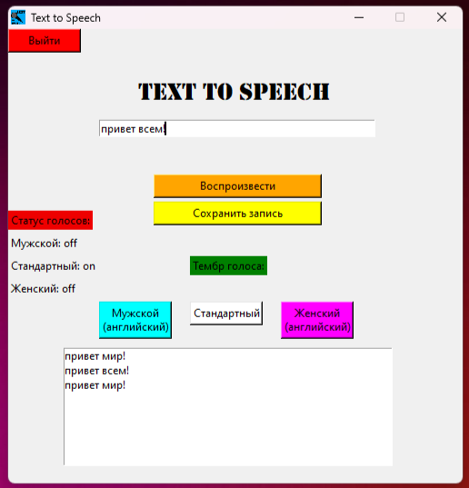

# Text-to-Speech-app
Простой проект приложения для преобразования текста в речь на python

Требования:
##
<tab><tab>code/pip install tkinter
1) tkinter library (pip install tkinter)
2) pyttsx3 library (pip install pyttsx3)
   
